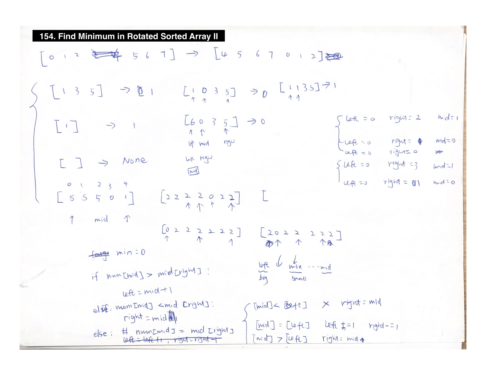

# Reason
[](https://leetcode.com)
[](https://github.com/jinwei14/java-PythonSyntax-Leetcode/issues)

好无聊，刷题玩玩。

- [x] Array [-->](#headArray)
- [x] String [-->](#headString)
- [x] HashTable/Counter [-->](#headHashTable)
- [x] LinkedList [-->](#headLinkedList)
- [ ] Stack [-->](#headStack)
- [ ] Queue [-->](#headQueue)
- [ ] Math [-->](#headMath)
- [ ] DFS/BFS [-->](#headDFS)
- [ ] Dynamic Programming [-->](#headDynamic)
- [ ] Searching [-->](#headSearching)
- [ ] Heap [-->](#headHeap)
- [ ] Bash [-->](#headBash)
- [ ] Bit [-->](#headBit)

## <a name="headArray"></a>Array
   [35. Search Insert Position.](https://leetcode.com/problems/search-insert-position/)   
   [41. First Missing Positive](https://leetcode.com/problems/first-missing-positive/) &nbsp;[-2,2,3,5]->1 wrong O(n^2) solution. O(n) is so hard.    
   [64. Minimum Path Sum](https://leetcode.com/problems/minimum-path-sum/)  
   [167. Two Sum II - Input array is sorted](https://leetcode.com/problems/two-sum-ii-input-array-is-sorted/) &nbsp; using two pointer, if small then move bigger if big move to smaller      
   [243. Shortest Word Distance](https://leetcode.com/problems/shortest-word-distance/) &nbsp; given word list find shorest dis between two words. one pass. need to define the shortest to max len first   
   [283. Move Zeroes](https://leetcode.com/problems/move-zeroes/) &nbsp; array deletion by element/index    
   [287. Find the Duplicate Number!](https://leetcode.com/problems/find-the-duplicate-number/) &nbsp; floyd circle algorithm !!!!!!!!!!      
        
   [463. Island Perimeter](https://leetcode.com/problems/island-perimeter/) &nbsp; easy 2D array   
   [448. Find All Numbers Disappeared in an Array](https://leetcode.com/problems/find-all-numbers-disappeared-in-an-array/) &nbsp;check which number is missing from 1 to n. brilliant sol by converting index num to neg.      
   [605. Can Place Flowers](https://leetcode.com/problems/can-place-flowers/ )&nbsp; single scan easy    
   [628. Maximum Product of Three Numbers](https://leetcode.com/problems/maximum-product-of-three-numbers/ )&nbsp;find the biggest product of 3 nums in array   
   [704. Binary Search](https://leetcode.com/problems/binary-search/) &nbsp; binary search in array implementation right/left = mid +- 1    
   [766. Toeplitz Matrix](https://leetcode.com/problems/toeplitz-matrix/) &nbsp;2D array that all diagonal are the same    
   [904. Fruit Into Baskets](https://leetcode.com/problems/fruit-into-baskets/) &nbsp; two item basket, find the largest range in array. Slicing window classic   
   [944. Delete Columns to Make Sorted](https://leetcode.com/problems/delete-columns-to-make-sorted/) &nbsp; pool descripted delete X column to make it alway ascending.   
   [Two Sum - Closest to target ](https://yeqiuquan.blogspot.com/2017/04/lintcode-533-two-sum-closest-to-target.html) &nbsp;Lintcode533 Amazon OA2 TwoSumClosest.py        

## <a name="headString"></a>String manipulation (addition, replace(deletion)):
   [9. Palindrome Number](https://leetcode.com/problems/palindrome-number/) &nbsp; classic palindrome number but used a werid amazing number reverse method.   
   [125. Valid Palindrome](https://leetcode.com/problems/valid-palindrome/) &nbsp; classic Palindrome number (two pointer/reversed)  
   [443. String Compression](https://leetcode.com/problems/string-compression/) &nbsp; easy,String    
   [482. License Key Formatting](https://leetcode.com/problems/license-key-formatting/)  
   [520. Detect Capital](https://leetcode.com/problems/detect-capital/) &nbsp; substring    
   [680. Valid Palindrome II](https://leetcode.com/problems/valid-palindrome-ii/) &nbsp; two pointer solution. s==s[::-1].   
   [844. Backspace String Compare](https://leetcode.com/problems/backspace-string-compare/)  
   [917. Reverse Only Letters](https://leetcode.com/problems/reverse-only-letters/) &nbsp;two pointer sol, string is immutable. convert to list then join.   

## <a name="headHashTable">HashTable/Counter:
   [number of substring with exact k distinct element](https://drive.google.com/drive/folders/1zfwa-4YmDQkF8B7QoYvo80lu3xqgkqPI) amazon OA2  NumOfSubstringwithExactKDistinctCharacters.py   
   [159. Longest Substring with At Most Two Distinct Characters](https://leetcode.com/problems/longest-substring-with-at-most-two-distinct-characters/) &nbsp; usnig hashMap but was shit. slicing windiw is better.   
   [169. Majority Element](https://leetcode.com/problems/majority-element/) &nbsp; most basic hashMap  
   [170. Two Sum III - Data structure design](https://leetcode.com/problems/two-sum-iii-data-structure-design/) &nbsp; same as two sum, but not good enough   
   [205. Isomorphic Strings](https://leetcode.com/problems/isomorphic-strings/) &nbsp; I use two arrays one check against two. Two check against one.  
   [219. Contains Duplicate II](https://leetcode.com/problems/contains-duplicate-ii/) &nbsp; easy hashMap    
   [246. Strobogrammatic Number](https://leetcode.com/problems/strobogrammatic-number/) &nbsp;hashtable + two pointer easy   
   [266. Palindrome Permutation](https://leetcode.com/problems/palindrome-permutation/) &nbsp; a word turn to palindrome after permu    
   [350. Intersection of Two Arrays II](https://leetcode.com/problems/intersection-of-two-arrays-ii/) &nbsp; easy classic hashMap  
   [389. Find the Difference](https://leetcode.com/problems/find-the-difference/) classic hashtable !   
   [438. Find All Anagrams in a String](https://leetcode.com/problems/find-all-anagrams-in-a-string/) &nbsp; classic slicing window problem !two hashtables + dictionary deletion  
   [532. K-diff Pairs in an Array](https://leetcode.com/problems/k-diff-pairs-in-an-array/) &nbsp; easy hashtable classic bloomberg interview.   
   [697. Degree of an Array](https://leetcode.com/problems/degree-of-an-array/) &nbsp; minLength of subarray with maxdegree.3 hashMaps    
   [706. Design HashMap](https://leetcode.com/problems/design-hashmap/) &nbsp; implementation of hashmap, easy   
   [760. Find Anagram Mappings](https://leetcode.com/problems/find-anagram-mappings/) &nbsp; different version of Anagram   
   [811. Subdomain Visit Count](https://leetcode.com/problems/subdomain-visit-count/)  
   [953. Verifying an Alien Dictionary](https://leetcode.com/problems/verifying-an-alien-dictionary/) &nbsp; a reverse version of alien dictionary. Given dictionary judge if it is vaild.    
   [961. N-Repeated Element in Size 2N Array](https://leetcode.com/problems/n-repeated-element-in-size-2n-array/) &nbsp; very easy hashMap   

## <a name="headLinkedList">LinkedList:
   [2. Add Two Numbers](https://leetcode.com/problems/add-two-numbers/) &nbsp; classic linkedlist plus Math plus  
   [21. Merge Two Sorted Lists](https://leetcode.com/problems/merge-two-sorted-lists/) &nbsp; keep track a previous node and keep updating prev.next, also recurrsive

   [83. Remove Duplicates from Sorted List](https://leetcode.com/problems/remove-duplicates-from-sorted-list/)  
   [141. Linked List Cycle](https://leetcode.com/problems/linked-list-cycle/)  &nbsp; hare and tortoise problem(floyd circle algorithm)   
   [142. Linked List Cycle II](https://leetcode.com/problems/linked-list-cycle-ii/) &nbsp; upgrade version of 141 same as question 287 floyd circle algorithm      
   [146. LRU Cache](https://leetcode.com/problems/lru-cache/) &nbsp; LRU linkedlist + hashmap/ dequeue + hashmap. classic    
   [160. Intersection of Two Linked Lists](https://leetcode.com/problems/intersection-of-two-linked-lists/) &nbsp; using two pointer to solove linkedlist, classic   
   [203. Remove Linked List Elements](https://leetcode.com/problems/remove-linked-list-elements/)  
   [206. Reverse Linked List](https://leetcode.com/problems/reverse-linked-list/) &nbsp;reverse(iteratively or recursively)  
   [234. Palindrome Linked List](https://leetcode.com/problems/palindrome-linked-list/) &nbsp; same as 9/125 Palindrome  
   [445. Add Two Numbers II](https://leetcode.com/problems/add-two-numbers-ii/) &nbsp; 1.reverse and reverse back. 2.using stack    
   [876. Middle of the Linked List](https://leetcode.com/problems/middle-of-the-linked-list/)

## <a name="headRecursive">Recursive:
Things to know:
1. The base case: this is the hardest to define. we need to figure out the boundury condition and return type
2. the recursion rules: the return type should be the same as base case, some time we need to keep an eye on whether it is a pre-order, post-order or in-order traversal.
3. write some easy example to run through. It is fine if the first two step are wrong, write some cases to figure which part is wrong.     
[Big O](https://stackoverflow.com/questions/13467674/determining-complexity-for-recursive-functions-big-o-notation)    

   [24. Swap Nodes in Pairs](https://leetcode.com/problems/swap-nodes-in-pairs/) &nbsp; use iterative or recurrsive

      

   [50. Pow(x, n)](https://leetcode.com/problems/powx-n/) &nbsp; brute force search TLE, recussive and iteration works

   [95. Unique Binary Search Trees II](https://leetcode.com/problems/unique-binary-search-trees-ii/) &nbsp; break down and G(n) = G(i-1)G(n-i)       
   


   [118. Pascal's Triangle](https://leetcode.com/problems/pascals-triangle/) &nbsp; TLE using recursion. use iterative approach instead.

   [206. Reverse Linked List](https://leetcode.com/problems/reverse-linked-list/) &nbsp;reverse lnkedlist (iteratively or recursively).

   [779. K-th Symbol in Grammar](https://leetcode.com/problems/k-th-symbol-in-grammar/) &nbsp; find the kth element by recussion.   
   


## <a name="headStack">Stack:
   [682. Baseball Game](https://leetcode.com/problems/baseball-game/) &nbsp; classic stack problem easy  
   [716. Max Stack](https://leetcode.com/problems/max-stack/) &nbsp; tuple in stack similar to MinStack but adding popMax!   
   [844. Backspace String Compare](https://leetcode.com/problems/backspace-string-compare/)  

## <a name="headQueue">Queue:
   [232. Implement Queue using Stacks](https://leetcode.com/problems/implement-queue-using-stacks/) &nbsp; using two stack to implement this   
   [346. Moving Average from Data Stream](https://leetcode.com/problems/moving-average-from-data-stream/) &nbsp; Queue implementation dequeue python.   

## <a name="headMath">Math
   [168. Excel Sheet Column Title](https://leetcode.com/problems/excel-sheet-column-title/) &nbsp; math same as 171, base 26 num.   
   [171. Excel Sheet Column Number](https://leetcode.com/problems/excel-sheet-column-number/) &nbsp; ASCII num + math   
   [202. Happy Number](https://leetcode.com/problems/happy-number/) &nbsp;loop + hashMap check existance. easy.   
   [204. Count Primes](https://leetcode.com/problems/count-primes/)  &nbsp; isPrime() find common facter of n from 0 to sqrt(n). Convert it to DP!    
   [231. Power of Two](https://leetcode.com/problems/power-of-two/) &nbsp; math problem, can be solved as bit manipulation as well. (bit count)  
   [258. Add Digits](https://leetcode.com/problems/add-digits/)    
   [263. Ugly Number](https://leetcode.com/problems/ugly-number/) &nbsp; easy math    
   [412. Fizz Buzz](https://leetcode.com/problems/fizz-buzz/)  
   [415. Add Strings](https://leetcode.com/problems/add-strings/) &nbsp; addition bit by bit plus carries   
   [888. Fair Candy Swap](https://leetcode.com/problems/fair-candy-swap/) &nbsp; sum(left)-x+y = sum(right)-y+x Math   
   [942. DI String Match](https://leetcode.com/problems/di-string-match/) &nbsp; Brilliant math problem   
   [970. Powerful Integers](https://leetcode.com/problems/powerful-integers/)&nbsp; attention to notes. x^i + y^j < bound    

## <a name="headDFS">DFS/BFS:
   [SubtreewithMaximumAverage](https://yeqiuquan.blogspot.com/2017/03/lintcode-597-subtree-with-maximum.html)&nbsp; lintcode Amazon OA2 SubtreewithMaximumAverage.py   
   [102. Binary Tree Level Order Traversal](https://leetcode.com/problems/binary-tree-level-order-traversal/) &nbsp; keep track of the level number as the index of the array       
   [104. Maximum Depth of Binary Tree](https://leetcode.com/problems/maximum-depth-of-binary-tree/)&nbsp; DFS post-order traversal to find the maximum depth.    
       
   [105. Construct Binary Tree from Preorder and Inorder Traversal](https://leetcode.com/problems/construct-binary-tree-from-preorder-and-inorder-traversal/) &nbsp; genius way of  constructing tree (mind the return type)      
   [106. Construct Binary Tree from Inorder and Postorder Traversal](https://leetcode.com/problems/construct-binary-tree-from-inorder-and-postorder-traversal/)  &nbsp;  same as 105 
   [107. Binary Tree Level Order Traversal II](https://leetcode.com/problems/binary-tree-level-order-traversal-ii/) &nbsp; same as 102 but output reversely
   [108. Convert Sorted Array to Binary Search Tree](https://leetcode.com/problems/convert-sorted-array-to-binary-search-tree/) &nbsp; This question is nearly the same as 106. Construct Binary Tree from Inorder and Postorder Traversal
   [112. Path Sum](https://leetcode.com/problems/path-sum/) &nbsp; pre-order traversal    
   [200. Number of Islands](https://leetcode.com/problems/number-of-islands/)  
   [226. Invert Binary Tree](https://leetcode.com/problems/invert-binary-tree/) &nbsp;BFS/DFS all can solved this   
   [250. Count Univalue Subtrees](https://leetcode.com/problems/count-univalue-subtrees/) &nbsp using standard dfs but you need to understand what substree is     
   [339. Nested List Weight Sum](https://leetcode.com/problems/nested-list-weight-sum/) &nbsp; DFS but using a new function everytime, classic!   
   [427. Construct Quad Tree](https://leetcode.com/problems/construct-quad-tree/) &nbsp; easy one recursion question is hard to read.    
   [543. Diameter of Binary Tree](https://leetcode.com/problems/diameter-of-binary-tree/) &nbsp; DFS, classic one   
   [965. Univalued Binary Tree](https://leetcode.com/problems/univalued-binary-tree/) &nbsp; easy DFS BFS using back tracking.    

## <a name="headDynamic">Dynamic Programming:
   [MaximumMinimumPath](https://drive.google.com/drive/folders/1zfwa-4YmDQkF8B7QoYvo80lu3xqgkqPI)Amazon OA2 MaximumMinimumPath.py   
   [5. Longest Palindromic Substring](https://leetcode.com/problems/longest-palindromic-substring/)&nbsp; Brute used need to be rewrite.   
   [42. Trapping Rain Water](https://leetcode.com/problems/trapping-rain-water/)&nbsp; given arrry of num represent of height, maximum trapped water, Brute force-> DP-> stack.   
   [70. Climbing Stairs](https://leetcode.com/problems/climbing-stairs/)&nbsp; classic DP    
   [121. Best Time to Buy and Sell Stock](https://leetcode.com/problems/best-time-to-buy-and-sell-stock/)  
   [174. Dungeon Game](https://leetcode.com/problems/dungeon-game/) very hard DP backwords DP.   
   [198. House Robber](https://leetcode.com/problems/house-robber/) &nbsp; current optimal = max(previousprevious opt + now, previous opt)    
   [509. Fibonacci Number](https://leetcode.com/problems/fibonacci-number/)&nbsp; Fibonacci number    
   [674. Longest Continuous Increasing Subsequence](https://leetcode.com/problems/longest-continuous-increasing-subsequence/)&nbsp; simple DB by store the previous result   

## <a name="headSearch">Search
   ```python
   def binarySearch(nums, target):
    """
    :type nums: List[int]
    :type target: int
    :rtype: int
    """
    if len(nums) == 0:
        return -1
    left, right = 0, len(nums) - 1
    while left <= right:
        mid = (left + right) // 2
        if nums[mid] == target:
            return mid
        elif nums[mid] < target:
            left = mid + 1
        else:
            right = mid - 1
    # End Condition: left > right
    return -1
   ```
   [69. Sqrt(x)](https://leetcode.com/problems/sqrtx/)&nbsp; Binary search      
   [33. Search in Rotated Sorted Array](https://leetcode.com/problems/search-in-rotated-sorted-array/) &nbsp; binarySearch case starting point not at index 0, find the starting point First    
          
   [34. Find First and Last Position of Element in Sorted Array](https://leetcode.com/problems/find-first-and-last-position-of-element-in-sorted-array/) &nbsp; using binary search to find the first element and expand to find the range     
       
   [35. Search Insert Position](https://leetcode.com/problems/search-insert-position/) &nbsp; binary search    
   [153. Find Minimum in Rotated Sorted Array](https://leetcode.com/problems/find-minimum-in-rotated-sorted-array/) &nbsp;  same as 33(first part)    
   [154. Find Minimum in Rotated Sorted Array II](https://leetcode.com/problems/find-minimum-in-rotated-sorted-array-ii/) &nbsp; using the same technique as 153 with more cases.
           
   [162. Find Peak Element](https://leetcode.com/problems/find-peak-element/) &nbsp; find the peak index in an array. break down cases     
       
   [270. Closest Binary Search Tree Value](https://leetcode.com/problems/closest-binary-search-tree-value/) &nbsp; binary search in BST.    
   [367. Valid Perfect Square](https://leetcode.com/problems/valid-perfect-square/) &nbsp; simply binary search to search from 0 to num//2 judge if a number is a perfect square number.     
   [374. Guess Number Higher or Lower](https://leetcode.com/problems/guess-number-higher-or-lower/) &nbsp; Binary search    
   [658. Find K Closest Elements](https://leetcode.com/problems/find-k-closest-elements/) &nbsp; using 35. then expand the array to range K.    
   [700. Search in a Binary Search Tree](https://leetcode.com/problems/search-in-a-binary-search-tree/) &nbsp; basic binary search in BST.    
         
   [702. Search in a Sorted Array of Unknown Size](https://leetcode.com/problems/search-in-a-sorted-array-of-unknown-size/) &nbsp; The standard solution is to use basic binary search from the given min 0 to max 10000. however we can find the approximate maxIndex by using a while and each time increase by 2^itr the find the mid index from hi/2 to hi this is amazing     
   [744. Find Smallest Letter Greater Than Target](https://leetcode.com/problems/find-smallest-letter-greater-than-target/) &nbsp; nearly same as 35 however this time rightIndex could be outof the length and leftIndex is the next to the target.      
   
    
## <a name="headHeap">Heap
   [215. Kth Largest Element in an Array](https://leetcode.com/problems/kth-largest-element-in-an-array/)&nbsp; this can literally done by sorting but MinMax heap is better (dont understand)   
   [703. Kth Largest Element in a Stream](https://leetcode.com/problems/kth-largest-element-in-a-stream/)&nbsp; minHeap with len(k) using heapq, pushpop()   

## <a name="headBash">Bash
   [195. Tenth Line](https://leetcode.com/problems/tenth-line/) &nbsp; print 10th line of a .txt  

## <a name="headBit">Bit  
   [190. Reverse Bits](https://leetcode.com/problems/reverse-bits/) &nbsp; reverse bits and convert to integer.   
   [191. Number of 1 Bits](https://leetcode.com/problems/number-of-1-bits/)&nbsp; hamming weight   
